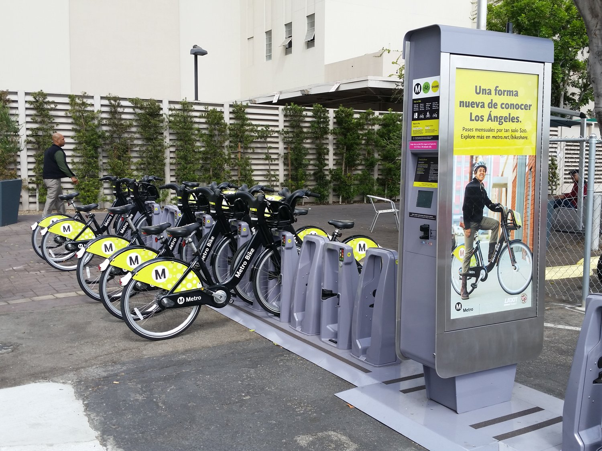
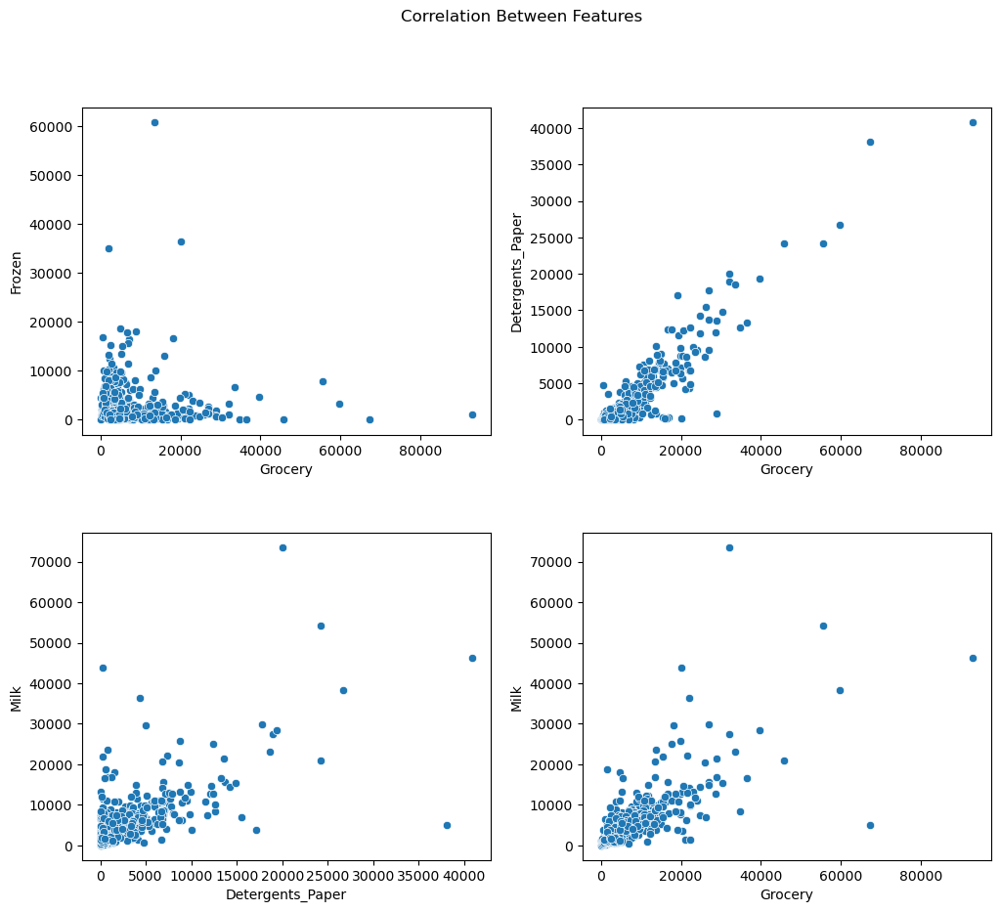
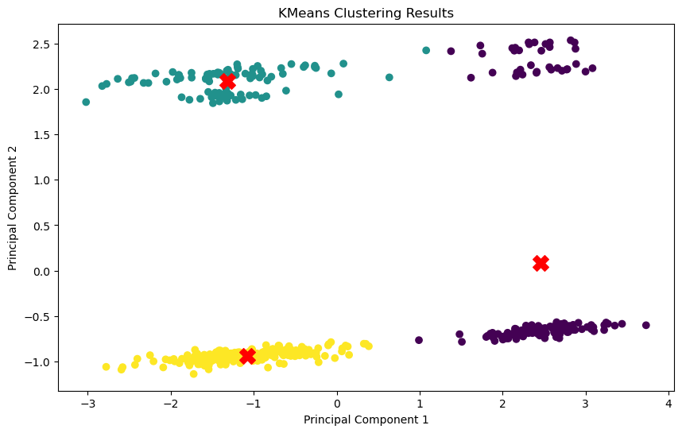
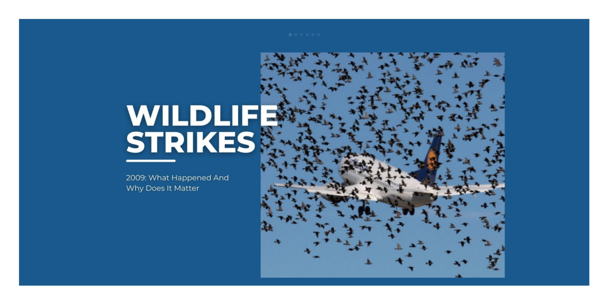
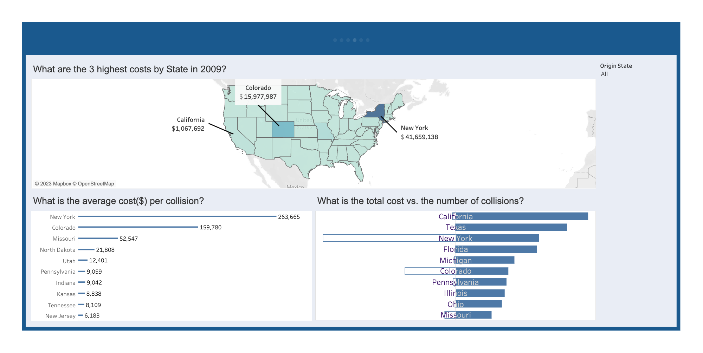

# Data Scientist
### Technical Skills: Python, SQL, Tableau
### Education
- Certificate, Data Science | [LightHouse Labs](https://www.lighthouselabs.ca/)(_Jan 2024_)
    
### Work Experience

**Apprentice Data Science Mentor @ [LightHouse Labs](https://www.lighthouselabs.ca/)(_Mar 2024_ - _Present_)**

- Provided individual and group support to students as they completed coursework, leveraging chat, video, and screen sharing technologies.
- Assisted students in completing assignments offering guidance and clarification as needed.
- Reviewed curriculum regularly to stay abreast of program content and identified any concerns or areas for improvement.
- Collaborated with instructors and administrators to ensure students received the necessary support for academic success.

**Student Intern @ [Via](https://www.solvewithvia.com/)(_Feb 2024_ - _Mar 2024_)**

- Contributed to the development of a data validation program utilizing Python with SQLAlchemy ORM to ensure data integrity and accuracy.
- Orchestrated the creation of comprehensive testing suites using Pytest, achieving almost 100% coverage to validate the effectiveness of the data validation processes.
  
### Projects
[**CityBikes Statistical Modeling**](https://github.com/Kanustu/CityBikes-Statistical-Modeling)
- Conducted statistical analysis with python on data collected from multiple sources, including the CityBikes, Foursquare and Yelp API's.
- Attempted to find a correalation between bike availabilty and the ratings and locations of businesses within a major city centre.

[**Unsupervised Learning Wholesale Data**](https://github.com/Kanustu/Unsupervised_Learning_Wholesale_Data)

- Performed unsupervised learning techniques on a wholesale data dataset. The project involved four main parts: exploratory data analysis and pre-processing, KMeans clustering, hierarchical clustering, and PCA.

[**Wildlife Strike Analysis**](https://github.com/Kanustu/Wildlife_Strike_Analysis)

- Utilized Tableau to convert FAA wildlife strike data into visually accessible insights, crafting dashboards tailored for informed decision-making in line with business queries. Effectively communicated these findings through well-suited visualizations.
  

[**DeepFaceDetect**](https://github.com/Kanustu/DeepFaceDetect)

- This project endeavours to distinguish authentic images (real) from those generated using deepfake technology, utilizing convolutional neural networks (CNN) in deep learning.
- The final product involved the creation of an application that was deployed with streamlit and can be found here [https://deepfacedetect.streamlit.app/]( https://deepfacedetect.streamlit.app/)

